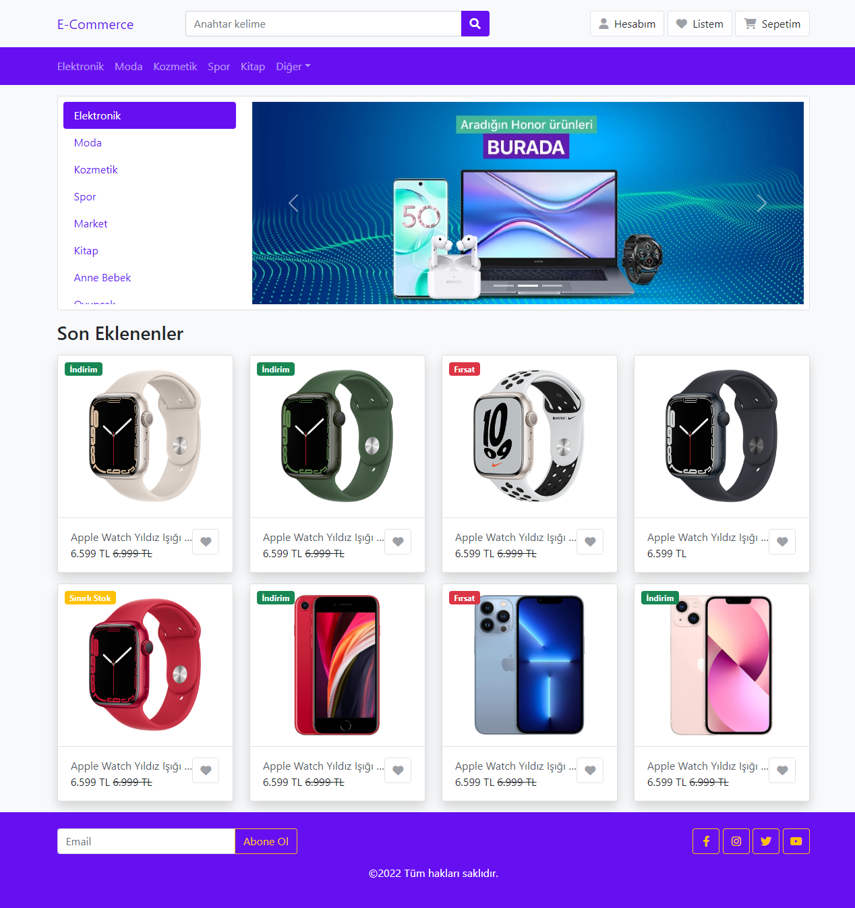

# Simple E-Commerce Template

First of all you should run following code to install necessary packages.
```bash
yarn install 

or

npm install
```

To use SCSS for customization run following code (this code convert scss file to css file)
```bash
yarn scss

or 

npm run scss
```

